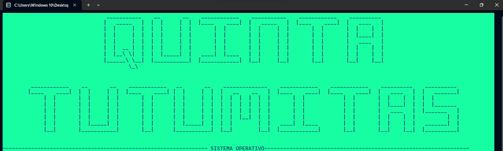
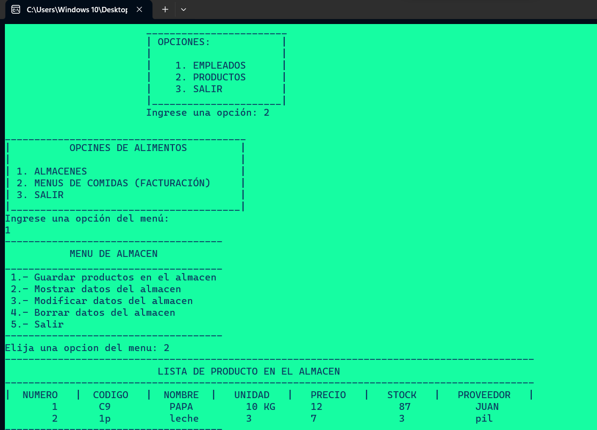
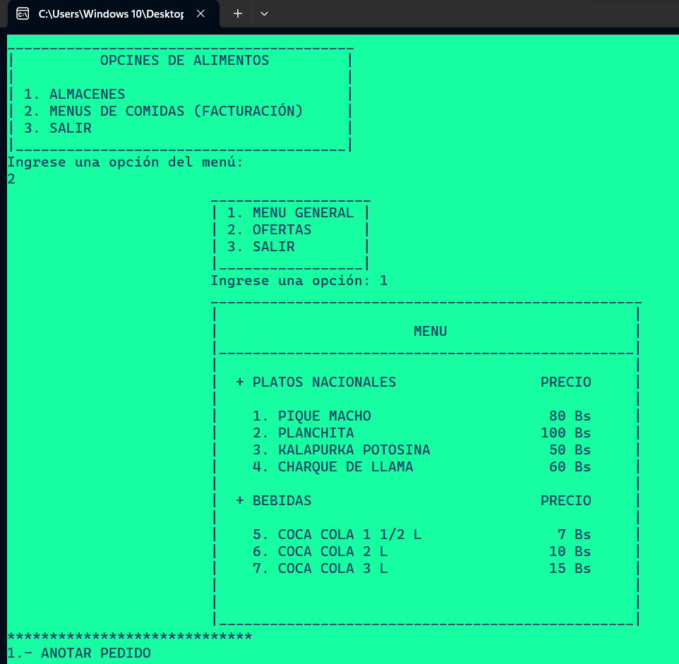

# Gestion-Restaurante-Con-C

## Descripción
Este es un sistema orientado a la gestión de un restaurante ficticio. Desarrollado con C++ permite gestionar los platos a servir, el almacén los productos y hasta el personal humano del restaurante.
Se hace uso de ficheros para guardar los datos que se generan en el proyecto.

## Características
- Gestión de Restaurante.
- Interfaz basada en la terminal.
- Control de personal, ingrediente y platos.

## Instrucciones de Uso
1. Compila el código utilizando un compilador de C++.
2. Ejecuta el programa en la terminal.
3. Seleccione las opciones y gestione su restaurante.

## Dependencias
El proyecto utiliza las bibliotecas estándar de C++ y puede requerir ajustes según el entorno de desarrollo. Ademas los ficheros se generan de forma automatica.

## Imagenes

    
    

## Licencia
Este proyecto está bajo la Licencia MIT. Consulta el archivo [LICENSE](LICENSE) para obtener más detalles.

---
